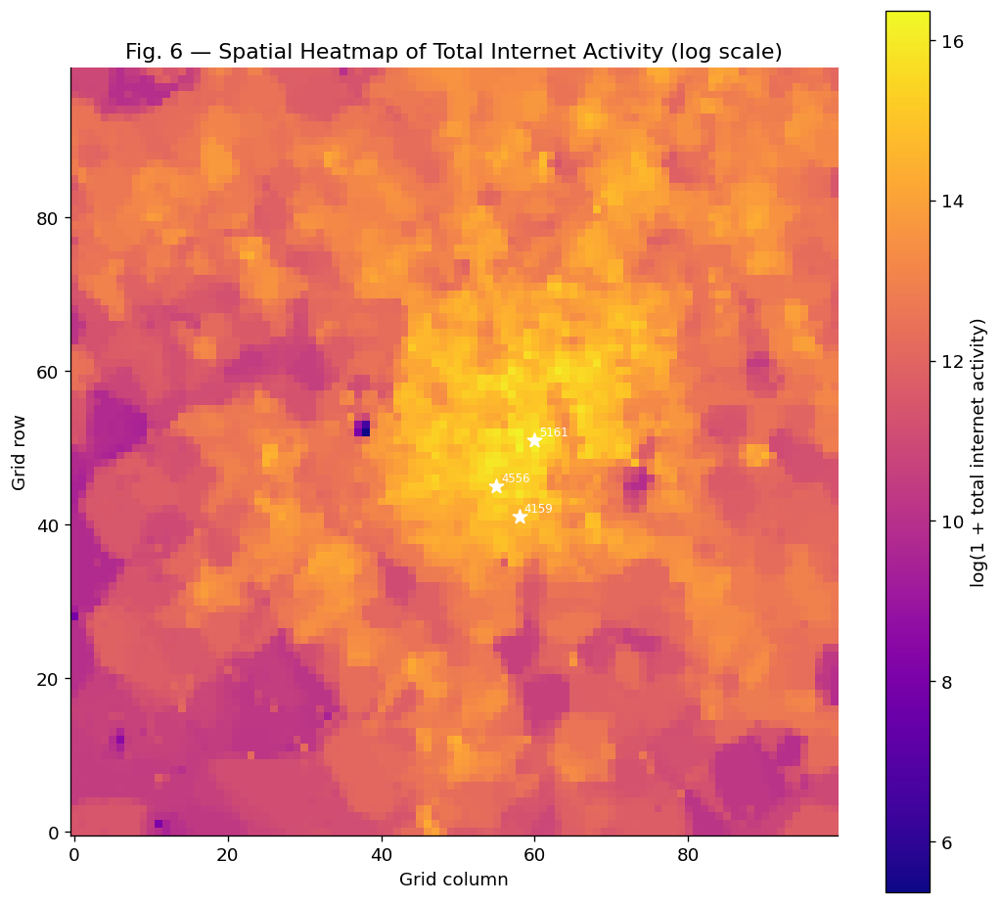
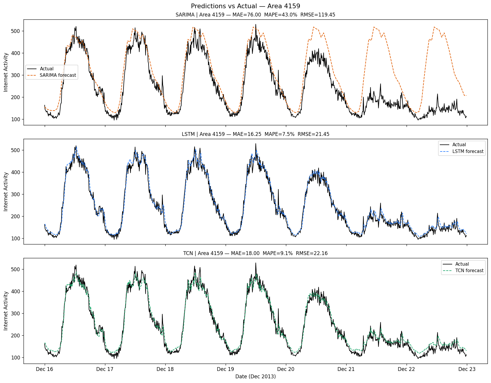

# Mobile Network Traffic Forecasting (Milan Dataset)

A comprehensive data engineering and time-series forecasting pipeline built to analyze and predict mobile internet traffic across the city of Milan. This project utilizes the **Telecom Italia Mobile (TIM)** dataset and implements both statistical and deep learning approaches (SARIMA, LSTM, and TCN) to perform highly accurate one-step-ahead forecasting.



## Key Features & Accomplishments

*   **Massive Data Ingestion:** Processed a raw 5GB dataset comprising 62 daily traffic files. Optimized memory overhead by aggregating 10-minute intervals and saving as a heavily compressed columnar Parquet file (~28MB), completely eliminating Out-Of-Memory errors.
*   **Deep Exploratory Analysis:** Conducted full EDA across 10,000 spatial grids, identifying log-normal traffic distributions, rigid 24-hour seasonalities (ACF/PACF validated), and anomalous public events.
*   **Comparative Forecasting:**
    *   `SARIMA`: Statistical baseline aggregated to hourly means to capture daily periodicity without crashing.
    *   `LSTM`: 2-layer Recurrent Network (128 hidden units, 0.2 dropout, Huber Loss).
    *   `TCN`: 5-block Dilated Temporal Convolutional Network (Exponential dilations: 1, 2, 4, 8, 16).

### Model Performance (Target Area 4159)
The Neural Networks drastically outperformed the statistical baseline. The **TCN** emerged as the best architecture, matching LSTM's accuracy but training in **1/3rd of the time** due to parallel convolutions.



| Model | MAE | MAPE (%) | RMSE | Avg Train Time (GPU) |
| :--- | :--- | :--- | :--- | :--- |
| **SARIMA** | 76.00 | 43.00 | 119.45 | 12.8s (CPU) |
| **LSTM** | 16.24 | 7.50 | 21.45 | 10.2s |
| **TCN** | 17.99 | 9.10 | 22.15 | **3.3s** |

*Note: Models suffer from a "Pre-Holiday Drop" covariate shift starting December 20th due to the weekend before Christmas breaking the standard Monday-Friday corporate traffic routine.*

---

## Repository Structure

```text
.
├── 01_data_handling.ipynb   # Task 1: Data loading, memory optimisation, Parquet export
├── 02_eda.ipynb             # Task 2: EDA, stationarity, decomposition, ACF/PACF, spatial mapping
├── 03_models.ipynb          # Task 3: Model architectures, comparative analysis, failure analysis
├── ingest_data.py           # Standalone ingestion and aggregation script
├── run_models.py            # PyTorch Model training and fast batched inference script
├── processed/               # Contains milan_internet_traffic.parquet
├── figures/                 # Generated plots (Heatmaps, PDFs, Predictions)
└── results/                 # Metrics CSVs and execution timings
```

## Setup & Execution

### 1. Requirements
Ensure Python 3.10+ is installed and install the required dependencies:
```bash
pip install pandas numpy pyarrow matplotlib seaborn geopandas statsmodels scikit-learn torch pmdarima
```

### 2. Data Acquisition
Download the raw data from the Harvard Dataverse and place the archives in the project root:
*   [Telecommunications activity (Milan)](https://dataverse.harvard.edu/dataset.xhtml?persistentId=doi:10.7910/DVN/EGZHFV)
*   [Grid GeoJSON](https://dataverse.harvard.edu/dataset.xhtml?persistentId=doi:10.7910/DVN/QJWLFU)

### 3. Execution Pipeline
Run the pipeline in the following order:

1.  **Ingest Data:** Stream the zip files into memory-mapped Parquet.
    ```bash
    python ingest_data.py
    ```
2.  **Train Models:** Run the GPU-accelerated forecasting loops.
    ```bash
    python run_models.py
    ```
3.  **View Analysis:** Open the Jupyter Notebooks to view the full academic reporting and data visualisations.

---
## References
[1] G. Barlacchi et al., "A multi-source dataset of urban life in the city of Milan and the Province of Trentino," Sci. Data, 2015.
